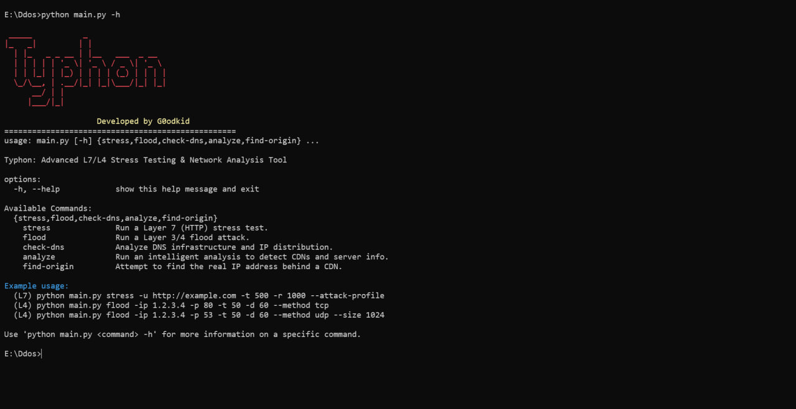

# Typhon: Advanced Network Toolkit

<br>[](https://www.gnu.org/licenses/gpl-3.0)
[](https://www.python.org/)
[](https://github.com/G0odKid/Erebus)
</br>

Typhon is a high-performance, multi-layered network stress testing and reconnaissance toolkit built in Python. It is designed for security professionals and network administrators to test the resilience of their infrastructure against various types of flood attacks and to perform advanced network analysis.

<br></br>

## Key Features

-   **Layer 7 Stress Testing:** Leverages `asyncio` for extremely fast, high-volume HTTP/HTTPS request generation. Supports proxy rotation and custom, weighted attack profiles for realistic traffic simulation.
-   **Layer 3/4 Flood Attacks:** Capable of launching powerful UDP and TCP floods to test network bandwidth and server connection handling capacity. Generates significant traffic volume (Gbps) from a single machine.
-   **Network Reconnaissance:** Includes a suite of tools for network intelligence gathering:
    -   **Origin Finder:** Discovers the real IP address of servers hidden behind Content Delivery Networks (CDNs).
    -   **DNS Analyzer:** Checks and analyzes the DNS infrastructure of a target domain.
-   **High Performance:** Built with modern Python libraries, using `asyncio` for non-blocking I/O in Layer 7 attacks and `threading` for parallelized, high-throughput Layer 3/4 floods.

## Installation (Linux)

This guide is for Debian-based distributions (like Ubuntu, Kali Linux).

**1. Clone the Repository**

```bash
git clone [https://github.com/your-username/Typhon.git](https://github.com/your-username/Typhon.git)
cd Typhon
```

**2. Install Python Dependencies**

Ensure you have Python 3.8+ and pip installed. Then, install the required libraries using the provided `requirements.txt` file.
```bash
pip install -r requirements.txt
```

That's it. The tool is now ready to use.

## Usage Guide

Typhon is a command-line tool with several distinct commands.

### Layer 7 - `stress`
This command performs HTTP-based stress tests.

Basic attack on a URL with 500 concurrent tasks:
```python
python main.py stress -u [http://example.com](http://example.com) -t 500 -r 1000
```

Target a specific IP and Port using proxies:
```python
python main.py stress -Ip 127.0.0.1:8080 -t 200 -r 5000 --proxy-file proxies.txt --insecure
```

Using a custom attack profile:
```python
python main.py stress -u [http://example.com](http://example.com) -t 500 -r 1000 --attack-profile
```

### Layer 3/4 - `flood`
This command launches network-level flood attacks.

UDP Flood:
Sends a UDP flood to the target for 120 seconds using 100 threads, with a packet size of 1400 bytes.
```python
python main.py flood -ip 192.168.1.100 -p 53 -t 100 -d 120 --method udp --size 1400
```

TCP Flood:
Sends a TCP connection flood to the target for 300 seconds using 200 threads.
```python
python main.py flood -ip 192.168.1.100 -p 80 -t 200 -d 300 --method tcp
```

### Network Analysis Tools
Find Origin IP (find-origin):
Attempts to find the real server IP behind a CDN like Cloudflare or ArvanCloud.
```python
python main.py find-origin -u [https://example.com](https://example.com)
```

### Analyze DNS (check-dns):
Gathers and analyzes DNS records for a given domain.
```python
python main.py check-dns -u example.com -c 200
```

## Configuration
You can customize Typhon's behavior by editing the files in the `data/` directory.
  - data/attack_profile.json: Define custom, multi-step Layer 7 attack sequences. You can specify different paths, methods, and weights for each request type.
  - data/user_agents.txt: A list of User-Agent strings used in Layer 7 attacks. Add your own, one per line.
  - data/headers.json: A list of HTTP header sets. The tool randomly chooses one for each request.
  - proxies.txt: To use proxies with the stress command, create this file in the root directory and add your proxies (format: ip:port), one per line.
## License
This project is licensed under the [GNU General Public License v3.0.](LICENSE) For more details, see the full license text.

## Disclaimer
This tool is intended for educational purposes and authorized security testing only. Using Typhon to attack networks or servers that you do not have explicit permission to test is illegal and unethical. The developer (G0odkid) assumes no liability and is not responsible for any
